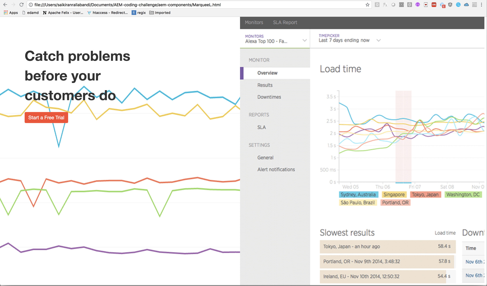

My solutions of <strong>coding challenge</strong> . Below are the details of the assessment

 1. Devops-like work, Apache Web Servers and Reverse Proxies set up in (aem-devops). Below the recorded session for the Reverse Proxy work and attaching the Reversproxy.txt. 
 
 <a href="https://asciinema.org/a/EBGQhLscMWUsY5EysiMYRethT">Watch demonstration of Reverse Proxy Set up</a>
 
 
 
 
 

 

 2.Component development work html is in (aem-components)

<b>MarqueeL</b>

1. aem-components/MarqueeL.html

 
<b>Product_Combinator</b>

 

2. aem-components/Product_Combinator.html[Note: newrelic.png image was build by combining all the images in one html as newrelic.html and export as newrelic.png]

